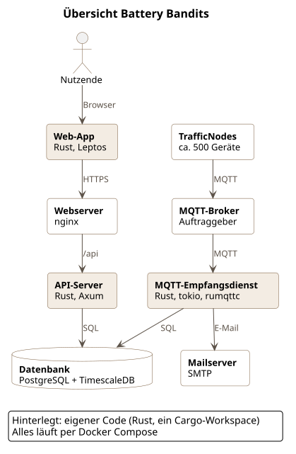

# Battery Bandits – TrafficNode Batterieüberwachung

> **Hinweis:** Dieses Projekt ist Teil der Lehrveranstaltung *Software Engineering I*, DHBW Stuttgart (TINF25D-KI)
> **Spezifikation v0.2.1**

  

---

## 1. Kontext

### a. Beschreibung

Ein Unternehmen betreibt mobile, batteriebetriebene Geräte (**TrafficNodes**) ohne eigene digitale Zustandsüberwachung. Schwache oder leere Batterien können zu Geräteausfällen und ungeplanten Serviceeinsätzen führen.

Eine nachrüstbare Telemetriebox (TrafficNode) erfasst Strom, Spannung und GPS-Position der Geräte und veröffentlicht die Messwerte auf einem MQTT-Broker. Hardware und Firmware der TrafficNode sind vorgegeben und nicht Teil dieses Projekts.

**Battery Bandits** empfängt die Batteriedaten ab dem MQTT-Broker, speichert sie und stellt sie in einem Dashboard dar. Das bringt zwei Vorteile:

- Der Batteriezustand lässt sich aus der Ferne beobachten und sein Verlauf nachvollziehen.
- Batteriewechsel werden rechtzeitig geplant, unnötige Wechsel vermieden.

Perspektivisch (Teil_B) sollen die gesammelten Daten außerdem darauf untersucht werden, ob sich geeignete Wechselzeitpunkte abschätzen lassen.

### b. Stakeholder

*Rollen und Interessen sind noch nicht mit dem Auftraggeber abgestimmt. Die folgende Einteilung ist ein erster Entwurf des Teams und muss verifiziert werden.*

| Stakeholder | Beschreibung | Ziel / Interesse |
|--------------|--------------|------------------|
| **Betreiber** | Unternehmen, das die TrafficNodes einsetzt | Batteriezustand überwachen, Serviceeinsätze planbar machen |
| **Servicetechniker** | Nutzende, die Batterien vor Ort wechseln | Wissen, welche Batterie wann fällig ist |
| **Betrieb / IT** | Betreibt die Software | Stabiler, wartbarer Betrieb |
| **Entwicklungsteam** | Battery Bandits | Klare, prüfbare Anforderungen |

## 2. Funktionale Anforderungen

Priorität: Hoch (Muss) · Mittel (Soll) · Niedrig (Kann)

| ID | Anforderung | Beschreibung | Priorität |
|----|-------------|--------------|-----------|
| F01 | **Datenempfang** | Das System empfängt Batteriemesswerte der TrafficNodes über den MQTT-Broker. | Hoch |
| F02 | **Datenspeicherung** | Jeder Messwert wird mit Geräte-ID, Zeitstempel und Ladestand gespeichert. | Hoch |
| F03 | **Geräteübersicht** | Nutzende sehen den aktuellen Batteriezustand aller Geräte. | Hoch |
| F04 | **Verlaufsansicht** | Nutzende sehen den Ladestand eines Geräts über einen wählbaren Zeitraum. | Hoch |
| F05 | **Kritisch-Markierung** | Geräte unter einem konfigurierbaren Schwellwert werden markiert. | Hoch |
| F06 | **Validierung** | Ungültige Nachrichten werden verworfen und protokolliert. | Hoch |
| F07 | **Offline-Erkennung** | Geräte ohne Daten seit einem konfigurierbaren Intervall werden erkannt. | Mittel |
| F08 | **Restlaufzeit-Prognose** | Das System schätzt die verbleibende Laufzeit anhand des Verlaufs. | Mittel |
| F09 | **Benachrichtigung** | Nutzende werden bei kritischem Zustand aktiv informiert (z. B. E-Mail). | Niedrig |
| F10 | **Login** | Zugriff auf das Dashboard nur für angemeldete Nutzende. | Niedrig |
| F11 | **Datenexport** | Nutzende können Messwerte/Verläufe als CSV oder Excel exportieren. | Mittel |
| F12 | **Standortanzeige** | Der zuletzt bekannte GPS-Standort eines Geräts wird angezeigt (z. B. Karte oder Standortliste). | Mittel |
| F13 | **Filter & Sortierung** | Die Geräteübersicht lässt sich nach Status, Standort und letztem Update filtern und sortieren. | Mittel |

Konkrete Prüfkriterien (Zahlenwerte für Zeit, Toleranzen etc.) sind noch nicht mit dem Auftraggeber abgestimmt und werden in A02 ergänzt.

---

## 3. Nicht-funktionale Anforderungen

| ID | Kategorie | Beschreibung | Priorität |
|----|-----------|--------------|-----------|
| NF01 | **Performance** | Ein neuer Messwert ist innerhalb von 30 Sekunden im Dashboard sichtbar. | Hoch |
| NF02 | **Skalierbarkeit** | Das System verarbeitet die Last einer mittleren Flotte von bis zu ca. 500 Geräten ohne Nachrichtenverlust. | Hoch |
| NF03 | **Zuverlässigkeit** | Verbindungsabbrüche zum Broker werden automatisch behoben, ohne feste Zeitvorgabe für die Wiederverbindung. | Mittel |
| NF04 | **Usability** | Kritische Geräte sind ohne Suche erkennbar. | Mittel |
| NF05 | **Testbarkeit** | Kernlogik ist automatisiert getestet; eine konkrete Ziel-Testabdeckung ist noch nicht festgelegt. | Hoch |
| NF06 | **Portabilität** | Das System ist per Container startbar. | Mittel |
| NF07 | **Wartbarkeit** | Schwellwerte und Intervalle sind ohne Codeänderung anpassbar. | Mittel |
| NF08 | **Datenhaltung** | Die Aufbewahrungsdauer der Messwerte richtet sich nach dem Bedarf des Auftraggebers und wird mit diesem festgelegt. | Mittel |
| NF09 | **Zugriffskontrolle** | Alle Nutzenden des Dashboards sind gleichberechtigt; es gibt keine unterschiedlichen Rollen oder Rechte. | Niedrig |

Weiterhin offen: konkrete Ziel-Testabdeckung (NF05) und die genaue Aufbewahrungsdauer (NF08) sind mit dem Auftraggeber abzustimmen (siehe Abschnitt 9).

---

## 4. Abgrenzung & MVP

Das Projekt wird **inkrementell** entwickelt. Ziel ist zunächst ein **MVP**, das den Kernnutzen demonstriert. Funktionen außerhalb des MVP werden als **Future Work** dokumentiert.

### MVP (Umfang des Projekts)
- Datenempfang und -speicherung ab dem MQTT-Broker (F01, F02, F06)
- Geräteübersicht mit Kritisch-Markierung, Filter und Sortierung (F03, F05, F13)
- Verlaufsansicht pro Gerät (F04)
- Eigener Testpublisher als Testdatenquelle (gemäß Aufgabenstellung ab A05 selbst zu entwickeln)

### Nicht Teil des MVP
- Offline-Erkennung, Prognose, Benachrichtigung, Login, Datenexport, Standortanzeige (F07–F12 → Future Work)
- Tourenplanung oder Auftragsverwaltung für Techniker
- Native Mobile-App

### Außerhalb des Projekts
- Hardware, Sensorik und Firmware der TrafficNodes
- Betrieb und Konfiguration des MQTT-Brokers
- Überwachung anderer Gerätewerte als der Batterie

---

## 5. Dictionary / Gemeinsames Begriffsverzeichnis

Das Dictionary legt fest, was wir im Projekt unter einem Begriff verstehen. Die englischen Entsprechungen gelten für Bezeichnungen im Code, in Topics und APIs. Ein Glossareintrag erweitert nicht den MVP-Umfang.

| Bevorzugter Begriff | Englisch / Code | Definition im Projekt | Abgrenzung / alternative Bezeichnungen |
|--------------------|-----------------|-----------------------|---------------------------------------|
| **TrafficNode** | Node | Mobiles, batteriebetriebenes Gerät des Betreibers, das Messwerte sendet. | „Gerät" wird synonym verwendet. Hardware und Firmware liegen außerhalb des Projekts. |
| **Messwert** | Reading | Einzelne Meldung eines TrafficNodes mit Geräte-ID, Zeitstempel und Ladestand. | Nicht mit „Nachricht" gleichsetzen: eine ungültige Nachricht ergibt keinen Messwert. |
| **Nachricht** | Message | Rohdaten, die über MQTT empfangen werden. | Wird erst nach erfolgreicher Validierung zum Messwert. |
| **Ladestand** | State of Charge (SoC) | Verbleibende Batteriekapazität. | Ob Spannung, Strom oder Prozent übertragen wird, ist offen (Frage 2). |
| **MQTT-Broker** | Broker | Server, der MQTT-Nachrichten zwischen Sendern und Empfängern verteilt. | Systemgrenze: Wir nutzen den Broker, betreiben ihn aber nicht. |
| **Topic** | Topic | Adresse, unter der MQTT-Nachrichten veröffentlicht werden. | Struktur noch mit dem Auftraggeber zu klären (Frage 1). |
| **Schwellwert** | Threshold | Konfigurierbarer Ladestand, unter dem ein Gerät als kritisch gilt. | Wert und ggf. Gerätespezifik noch offen (Frage 4). |
| **Kritisch** | Critical | Zustand eines Geräts, dessen letzter Ladestand unter dem Schwellwert liegt. | Nicht gleich „offline". |
| **Offline** | Offline | Gerät hat länger als das definierte Intervall keinen Messwert gesendet. | Sagt nichts über den Ladestand aus. |
| **Verlauf** | History | Zeitliche Abfolge der Messwerte eines Geräts. | — |
| **Batteriewechsel** | Battery replacement | Serviceeinsatz zum Austausch der Batterie vor Ort. | Wird vom System nicht durchgeführt, nur vorbereitet. |
| **Standort** | Location | Zuletzt bekannte GPS-Position eines Geräts. | Wird zusammen mit dem Messwert übertragen; genaues Format offen (Frage 1). |
| **Export** | Export | Herunterladen von Messwerten/Verläufen als CSV oder Excel. | Bezieht sich auf bereits gespeicherte Daten, keine Echtzeit-Schnittstelle. |

### Pflege und offene Begriffsentscheidungen

- **Ein Begriff pro Bedeutung:** Synonyme zuordnen, unterschiedliche Konzepte getrennt benennen.
- **Unklarheiten früh erfassen:** Neue Begriffe vor der Umsetzung ergänzen und offene Definitionen markieren.
- **Änderungen gemeinsam prüfen:** Begriffsänderungen per Pull Request; betroffene Anforderungen, Tests und Code-Bezeichnungen mitprüfen.
- **Offene Punkte:** Einheit des Ladestands, Höhe des Schwellwerts, Länge des Offline-Intervalls.

---

## 6. Team & Organisation

**Teamname:** Battery Bandits
| Name | Matrikelnummer |
|------|----------------|
| Noah Boufercha | 1455982 |
| Fynn Becker | 3487242 |

---
## 7. Tools & Technologien

| Bereich | Entscheidung |
|---------|--------------|
| Messaging | MQTT (Broker des Auftraggebers) |
| Backend | Rust mit Axum (API-Server) und tokio + rumqttc |
| Frontend | Rust mit Leptos (WebAssembly) |
| Codebasis | Ein Cargo-Workspace mit gemeinsamen Typen für Frontend und Backend |
| Datenbank | PostgreSQL mit TimescaleDB |
| Deployment | Docker Compose |

### Backend

- **Kontext:**
  - Dauerhafter MQTT-Empfang mit Prüfung und Speicherung
  - Datenversorgung des Dashboards
  - Langer Betrieb ohne Ausfälle, wartbar und testbar
  - Observer-Muster vorgegeben
- **Entscheidung:**
  - Rust, eine Codebasis, zwei Prozesse: MQTT-Empfangsdienst und API-Server
  - Empfangsdienst: tokio (async) + rumqttc (MQTT, automatisches Wiederverbinden)
  - API-Server: Axum, Live-Updates per Server-Sent Events
  - Datenbankzugriff: SQLx, SQL-Abfragen werden beim Kompilieren gegen die Datenbank geprüft
  - Observer-Muster über Trait `ReadingObserver`; Empfänger benachrichtigt angemeldete Beobachter (Speichern, Statusprüfung, Live-Update)
  - Login und Sessions über tower-sessions, Passwörter mit Argon2
- **Alternativen:**
  - *Actix Web:* sehr schnell, aber eigene Laufzeit-Konzepte, weniger Anbindung an das tower-Ökosystem
  - *Rocket:* angenehme Syntax, aber langsamere Weiterentwicklung
  - *Kotlin + Spring Boot:* ausgereift, aber zweite Sprache neben dem Frontend, JVM mit höherem Speicherbedarf
  - *Python + FastAPI:* schneller Einstieg, aber dynamische Typen
  - *Microservices:* bei ca. 1,7 Nachrichten/s unnötig
- **Konsequenzen:**
  - (+) Speicher- und Thread-Sicherheit durch den Compiler, keine Null-Fehler (`Option`, `Result`)
  - (+) SQL-Fehler fallen schon beim Kompilieren auf
  - (+) Sehr geringer Ressourcenbedarf, kleine Container
  - (+) Datenempfang läuft bei API-Neustart weiter
  - (−) Steile Lernkurve (Ownership, Borrow Checker, Lifetimes, async)
  - (−) Längere Kompilierzeiten
  - (−) Weniger fertige Bausteine als Spring (z. B. Login, Rollen teilweise selbst bauen)

### Frontend

- **Kontext:**
  - Stark interaktives Dashboard (Filter, Suchfelder, Diagramme, Live-Updates, Karte, Dialoge)
  - Nutzbar auf dem Handy
  - Neue Werte nach ≤ 10 s sichtbar
- **Entscheidung:**
  - Leptos als Single-Page-App, kompiliert zu WebAssembly, Build mit Trunk
  - Gemeinsame Datentypen mit dem Backend aus dem Workspace-Paket `shared`
  - Diagramme über charming (Rust-Wrapper für Apache ECharts), Karte über Leaflet per JavaScript-Interop (wasm-bindgen)
  - Live-Updates per Server-Sent Events
- **Alternativen:**
  - *Dioxus:* ähnlich wie Leptos, zusätzlich Desktop und Mobile, aber jünger
  - *Yew:* ältestes Rust-Frontend-Framework, aber langsamer und mehr Boilerplate als Leptos
  - *React + TypeScript:* größtes Ökosystem, aber zweite Sprache, Typen nur über generierte API-Beschreibung
  - *Mockup weiterverwenden:* über 3.000 Zeilen in einer Datei, kaum wartbar und testbar
- **Konsequenzen:**
  - (+) Eine Sprache von Datenbank bis Browser
  - (+) Ein Typ für Frontend und Backend: Änderung im Backend bricht sofort den Frontend-Build
  - (+) Feingranulare Reaktivität, sehr schnelle Oberfläche
  - (−) Deutlich weniger fertige Komponenten als bei React (Tabellen, Combobox, Dialoge teils selbst bauen)
  - (−) Karte und Teile der Diagramme über JavaScript-Interop
  - (−) Größerer erster Download (WebAssembly-Datei)

### Datenbank

- **Kontext:**
  - Ca. 144.000 Messwerte/Tag, 12 Monate Aufbewahrung, rund 52 Mio. Datensätze
  - Relationale Daten (Geräte, Meldungen, Nutzende), gemeinsam mit Messwerten abgefragt
- **Entscheidung:**
  - PostgreSQL mit Erweiterung TimescaleDB
  - Zugriff über SQLx, Migrationen mit `sqlx migrate`
- **Alternativen:**
  - *InfluxDB 3:* in Rust geschrieben, nur Zeitreihen, zweite Datenbank nötig; Open-Source-Version auf jüngere Daten ausgelegt
  - *QuestDB:* sehr schnelle Zeitreihen mit SQL, aber kaum relationale Funktionen
  - *ClickHouse:* stark bei Auswertungen über riesige Datenmengen, für diese Größe überdimensioniert, Änderungen einzelner Zeilen umständlich
  - *SurrealDB:* in Rust geschrieben, mehrere Datenmodelle in einer Datenbank, aber jung und ohne Zeitreihen-Funktionen
  - *PostgreSQL ohne Erweiterung:* Fallback; Partitionierung, Aggregate, Löschen in Eigenbau
- **Konsequenzen:**
  - (+) Eine Datenbank für Zeitreihen und relationale Daten, normales SQL
  - (+) Eingebaut: Partitionierung, Kompression, Tageswerte (Continuous Aggregates), Löschen nach 12 Monaten
  - (+) Volle SQLx-Unterstützung inklusive Prüfung beim Kompilieren
  - (−) Erweiterung muss im Datenbank-Image enthalten sein