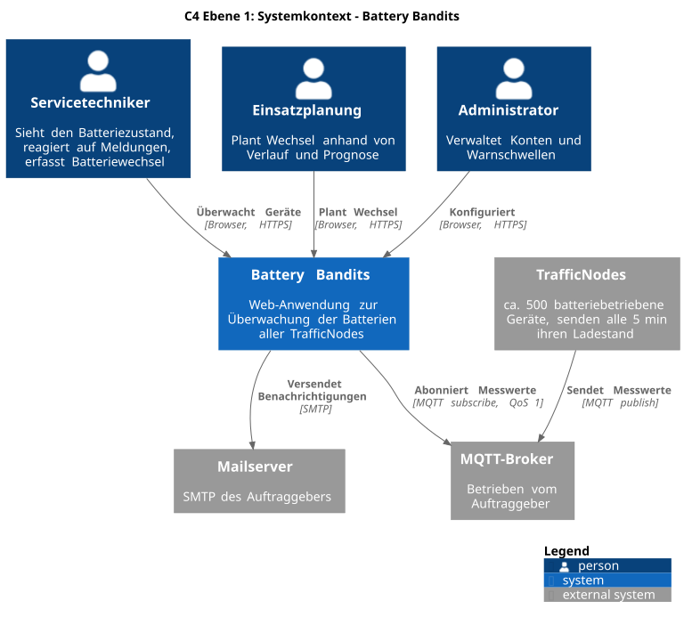
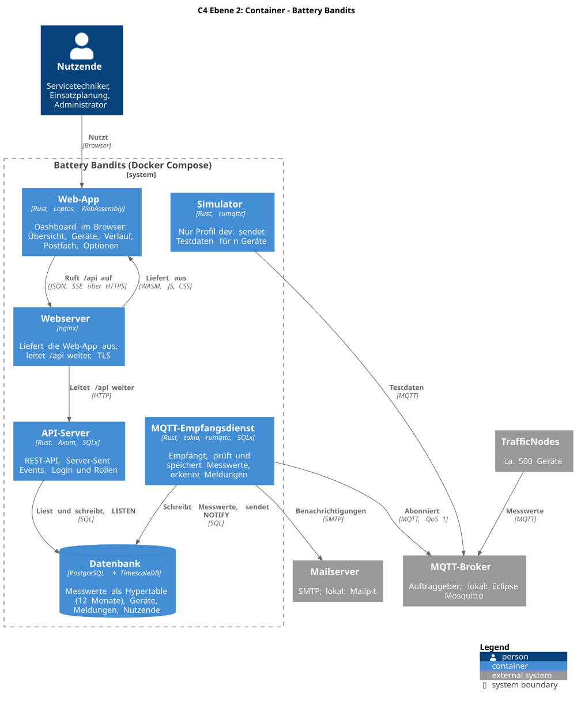
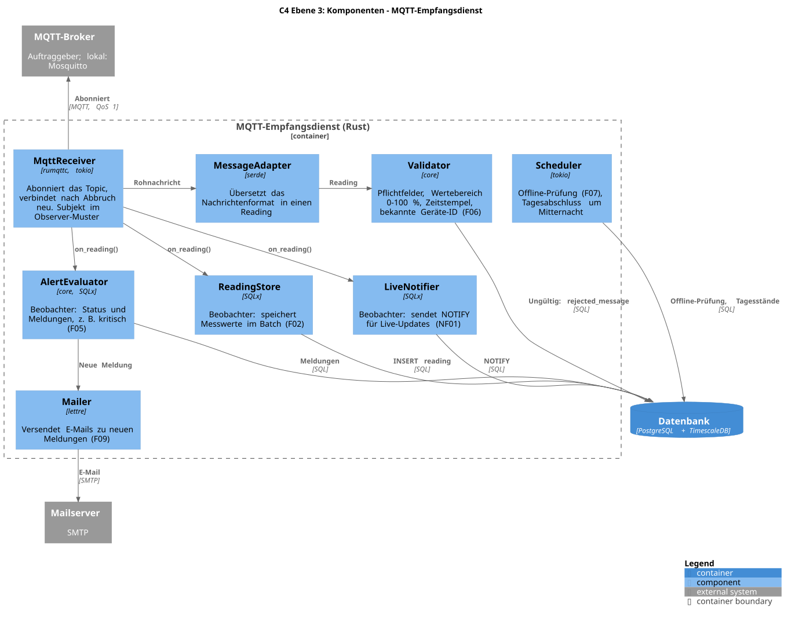
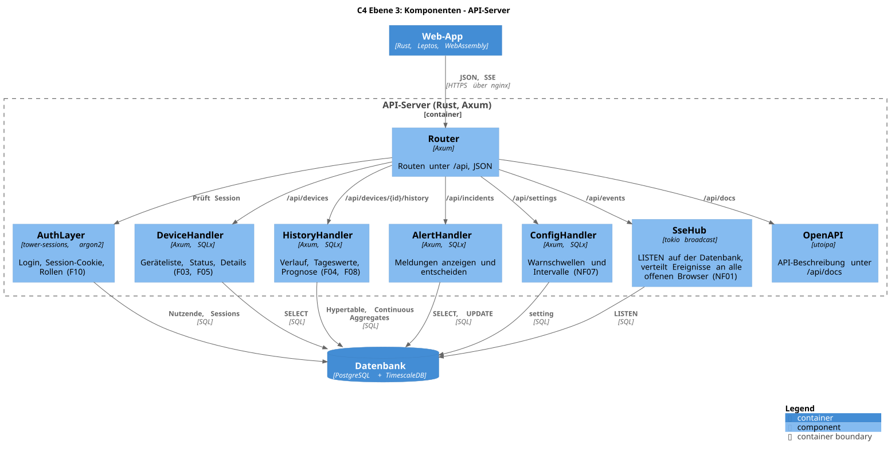
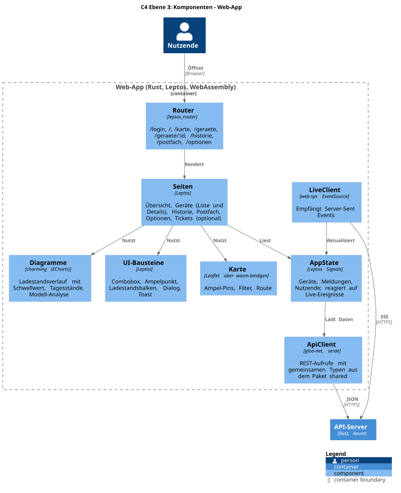
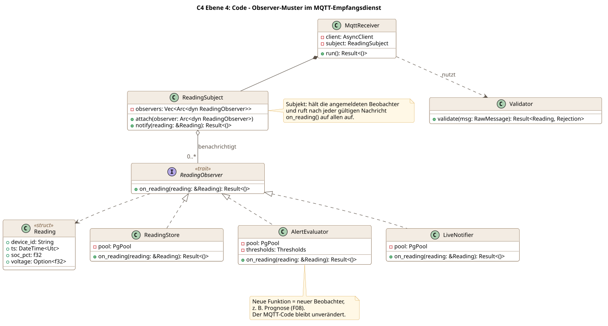
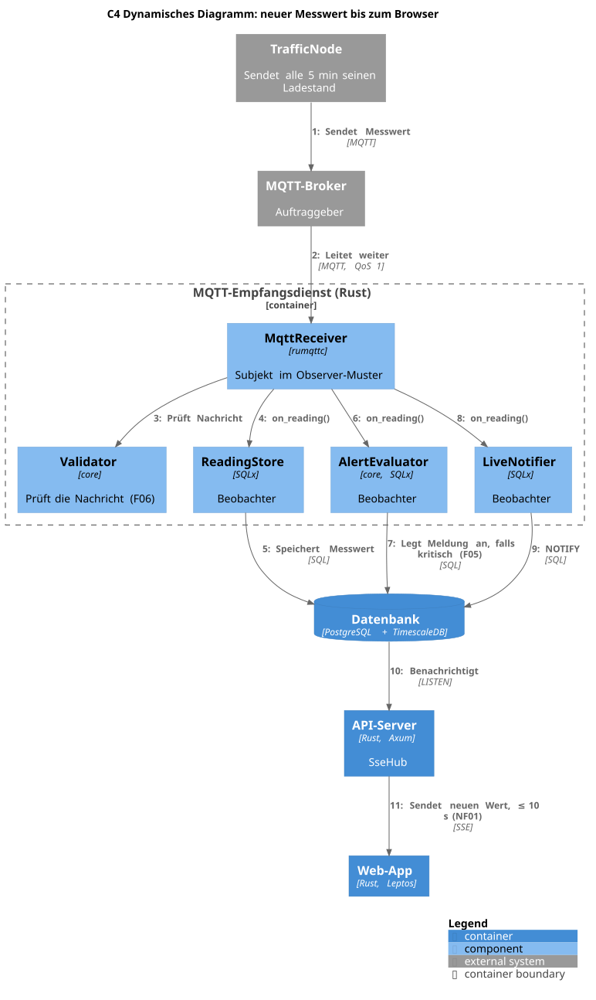
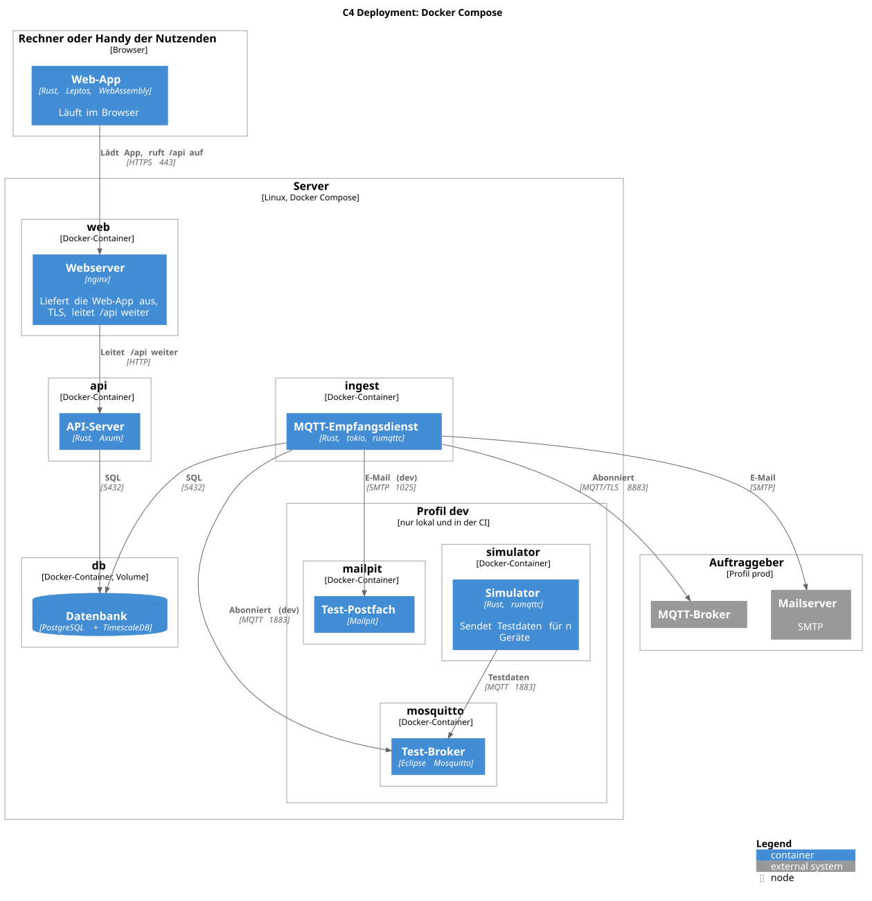

# Architektur nach C4-Modell

Die Diagramme folgen dem [C4-Modell](https://c4model.com) und sind mit [C4-PlantUML](https://github.com/plantuml-stdlib/C4-PlantUML) beschrieben. Bearbeitet werden nur die `.puml`-Dateien. Die `.svg`-Dateien erzeugt der Workflow `.github/workflows/plantuml.yml` bei jedem Push automatisch.

## Ebene 1: Systemkontext

Battery Bandits zwischen Nutzenden, TrafficNodes, MQTT-Broker und Mailserver des Auftraggebers.

## Ebene 2: Container

Zwei eigene Rust-Prozesse (MQTT-Empfangsdienst und API-Server), die Web-App im Browser und eine gemeinsame Datenbank. Der Simulator läuft nur im Profil `dev`.

## Ebene 3: Komponenten

### MQTT-Empfangsdienst

Der `MqttReceiver` ist das Subjekt im Observer-Muster und benachrichtigt nach jeder gültigen Nachricht die Beobachter.

### API-Server

### Web-App

Aufbau entsprechend dem UI-Mockup.

## Ebene 4: Code

Umsetzung des vorgegebenen Observer-Musters. Neue Funktionen kommen als weiterer Beobachter hinzu, ohne den MQTT-Code zu ändern.

## Ergänzende Diagramme

### Dynamisches Diagramm

Ablauf eines Messwerts vom TrafficNode bis zur Anzeige im Browser.

### Deployment

Docker Compose mit den Profilen `dev` und `prod`.

